# 🤖 NexaCorp AI Support System - Agent Lightning with Google ADK

[](https://www.python.org/downloads/)
[](https://opensource.org/licenses/MIT)
[](https://google.github.io/adk-docs/)
[](https://github.com/agentops-ai/agent-lightning)
[](https://streamlit.io/)
[](https://ai.google.dev/)

## 🚀 Overview

This project implements a **cutting-edge multi-agent AI support system** powered by **Google's Agent Development Kit (ADK)** and enhanced with the **Agent Lightning framework** for emergent communication and reinforcement learning. The system demonstrates advanced AI coordination through specialized agents that learn optimal communication protocols and decision-making strategies.

### 🌟 Key Features

| **Capability** | **Description** |
|----------------|-----------------|
| 🤖 **Google ADK Integration** | Powered by Google's Agent Development Kit with Gemini 2.0 Flash models |
| ⚡ **Agent Lightning Framework** | Advanced RL training with emergent communication and agent-as-tools capabilities |
| 🧠 **Emergent Communication** | Dynamic communication protocols that adapt and optimize based on performance |
| 🎯 **Multi-Agent Architecture** | Specialized agents for Communication, Retrieval, Criticism, and Escalation |
| 🔄 **Reinforcement Learning** | Q-learning based decision optimization for routing, escalation, and tool usage |
| 📚 **Unified Knowledge Base** | Automatically processes CSV, XLSX, DOCX, PDF, and TXT files with semantic search |
| ⚠️ **Smart Escalation** | Intelligent severity detection with automated email alerts for critical issues |
| 🌐 **Multilingual Support** | Supports 10+ languages with automatic detection and translation |
| 🛠️ **Agent-as-Tools** | Agents can use other agents as tools for complex task coordination |
| 📊 **AgentOps Monitoring** | Comprehensive observability and performance tracking for multi-agent interactions |
| 🎮 **Interactive Training** | Real-time RL training dashboard with performance visualization |

## 🚀 Agent Lightning Framework

This system implements the **Agent Lightning** framework for advanced multi-agent reinforcement learning and emergent communication:

### 🧠 Key Agent Lightning Features

- **🔄 Training-Agent Disaggregation**: Separates agent execution from RL training for scalable learning
- **💬 Emergent Communication**: Intelligent communication protocols that adapt based on performance
- **🔧 Agents-as-Tools**: Agents can use other agents as tools for complex task coordination
- **🎯 Advanced Reward System**: Multi-signal reward calculation with adaptive shaping
- **📊 AgentOps Monitoring**: Comprehensive observability and performance tracking
- **🧪 RL Decision Making**: Q-learning based decision optimization for routing, escalation, and tool usage

### 🔄 Agent Lightning Workflow

```mermaid
graph TB
    User[👤 User Query] --> Enhanced[🚀 Enhanced Coordinator<br/>Agent Lightning]
    Enhanced --> Monitor[📊 AgentOps Monitor<br/>Track Interactions]
    Enhanced --> Comm[💬 Communication Manager<br/>Emergent Protocols]
    Enhanced --> RL[🧠 RL Coordinator<br/>Decision Optimization]
    Enhanced --> Tools[🔧 Tool Coordinator<br/>Agent-as-Tools]

    RL --> |RL Decision| CommAgent[🤖 Communication Agent]
    CommAgent --> |Smart Routing| RetAgent[🔍 Retrieval Agent]
    RetAgent --> |Quality Check| CritAgent[⭐ Critic Agent]
    CritAgent --> |Severity Check| EscAgent[⚠️ Escalation Agent]

    Tools --> |Tool Usage| CommAgent
    Tools --> |Tool Usage| RetAgent
    Tools --> |Tool Usage| CritAgent

    Monitor --> |Reward Signals| RL
    Comm --> |Communication Events| Monitor

    EscAgent --> |Final Response| User
```



## 🏗️ Architecture

### Google ADK Integration

The system leverages Google's Agent Development Kit (ADK) for advanced AI capabilities:

- **LlmAgent**: Each agent uses Google ADK's LlmAgent with Gemini 2.0 Flash models
- **Runner**: Manages agent execution and message processing
- **Session Management**: In-memory session service for conversation context
- **Structured Instructions**: Each agent has specialized instructions for optimal performance

### Agent Architecture

```
┌─────────────────┐    ┌─────────────────┐    ┌─────────────────┐
│ Communication   │    │ Retrieval       │    │ Critic          │
│ Agent           │───▶│ Agent           │───▶│ Agent           │
│ (Query Analysis)│    │ (Knowledge RAG) │    │ (Quality Check) │
│ + ADK + RL     │    │ + ADK + RL     │    │ + ADK + RL     │
└─────────────────┘    └─────────────────┘    └─────────────────┘
         │                                              │
         ▼                                              ▼
┌─────────────────┐                            ┌─────────────────┐
│ Escalation      │                            │ User Response   │
│ Agent           │                            │ & Feedback      │
│ (Severity Check)│                            │                 │
│ + ADK + RL     │                            │                 │
└─────────────────┘                            └─────────────────┘
```

### Agent Capabilities

- **Communication Agent**: Smart query classification, language detection, response routing with emergent protocols
- **Retrieval Agent**: Knowledge base search, RAG synthesis, content filtering with RL-optimized strategies
- **Critic Agent**: Response quality evaluation, feedback generation, performance assessment with learning
- **Escalation Agent**: Severity assessment, automatic escalation, email notifications with adaptive thresholds

## 🚀 Getting Started

This guide will walk you through the steps to get the NexaCorp AI Support System up and running on your local machine.

### Prerequisites

Make sure you have the following installed:

*   **Python 3.10+**
*   **Git**

You will also need the following API keys:

*   **Google API Key**: For using the Gemini models.
*   **AgentOps API Key** (Optional): For enhanced monitoring with AgentOps.

### Installation and Setup

**1. Clone the Repository**

First, clone the repository to your local machine:

```bash
git clone https://github.com/your-username/ec-gadk.git
cd ec-gadk
```
**Note:** Replace `your-username` with your actual GitHub username if you have forked the repository.

**2. Install Dependencies**

Install the required Python packages using pip:

```bash
pip install -r requirements.txt
```

**3. Configure Environment Variables**

The project uses a `.env` file to manage API keys and other secrets.

*   Copy the example environment file:
    ```bash
    cp .env.example .env
    ```
*   Open the `.env` file in a text editor and add your API keys:
    ```
    GEMINI_API_KEY="your_google_api_key_here"
    AGENTOPS_API_KEY="your_agentops_api_key_here" # Optional
    ```

**4. Set Up the Dataset**

The knowledge base for the system is built from documents in the `dataset` directory. Before you can build the knowledge base, you need to add the following files to the `dataset` directory:

*   `NexaCorp HR Manual.docx`
*   `NexaCorp IT Support Manual.docx`
*   `NexaCorp Payroll Support Manual.docx`
*   `aa_dataset-tickets-multi-lang-5-2-50-version.csv`
*   `dataset-tickets-german_normalized.csv`
*   `dataset-tickets-german_normalized_50_5_2.csv`
*   `dataset-tickets-multi-lang3-4k.csv`
*   `dataset-tickets-multi-lang-4-20k.csv`
*   `nexacorp_tickets.xlsx`

**5. Build the Knowledge Base**

Once the dataset files are in place, run the following command to build the FAISS index and metadata for the knowledge base:

```bash
python dataset/build_database.py
```

This script will process the documents, generate embeddings, and save the knowledge base files in the `kb` directory.

**6. Configure Escalation Emails**

For the escalation feature to work correctly, you need to configure the sender and recipient email addresses in the system configuration file.

*   Open `config/system_config.yaml`.
*   Locate the `email` section.
*   Change the `sender_email`, `sender_password`, and `escalation_recipients` to your desired values.

```yaml
email:
  smtp_server: "smtp.gmail.com"
  smtp_port: 587
  use_tls: true
  sender_email: "your_email@example.com"
  sender_password: "your_app_password"
  escalation_recipients:
    - "manager@example.com"
```
**Note:** For Gmail, you will need to use an "App Password" if you have 2-Factor Authentication enabled.

### Running the Application

**1. Launch the Streamlit Dashboard**

To start the application, run the following command:

```bash
streamlit run ui/streamlit_app.py
```

This will open the NexaCorp AI Support System dashboard in your web browser.

**2. Initialize Agent Lightning**

For the agent to function correctly and provide metrics like confidence scores, you need to initialize the Agent Lightning framework.

*   In the Streamlit app, navigate to the **🚀 Agent Lightning** tab.
*   Click the initialization button to start the Agent Lightning services.

You are now ready to interact with the AI support system!

## 🎮 Usage Examples

### Basic Query Processing

```python
from agents.base_agent import AgentCoordinator
from agents.communication.communication_agent import CommunicationAgent
from agents.retrieval.retrieval_agent import RetrievalAgent
from agents.critic.critic_agent import CriticAgent
from agents.escalation.escalation_agent import EscalationAgent
from rl.agent_lightning.enhanced_coordinator import create_enhanced_coordinator

# Initialize agents
agents = {
    "communication_agent": CommunicationAgent(),
    "retrieval_agent": RetrievalAgent(),
    "critic_agent": CriticAgent(),
    "escalation_agent": EscalationAgent(),
}

# Create enhanced coordinator with Agent Lightning
coordinator = create_enhanced_coordinator(agents)

# Process a query
result = await coordinator.process_query_enhanced("I can't access my account")
```

### Emergent Communication Demo

```python
# Run the emergent communication demo
python demo_emergent_communication.py
```

This demo showcases:
- Dynamic communication protocol selection
- RL-based decision making
- Emergent communication patterns
- Performance optimization

## 📊 Monitoring & Training

The application includes a comprehensive dashboard for monitoring and training the agents, powered by Agent Lightning.

### Accessing the Dashboard

The monitoring and training dashboard is available within the main Streamlit application.

1.  Run the application:
    ```bash
    streamlit run ui/streamlit_app.py
    ```
2.  Navigate to the **🚀 Agent Lightning** and **🎓 RL Training** tabs to access the dashboards.

### Features

-   **RL Performance**: Track training episodes, reward curves, and action distributions.
-   **Communication Patterns**: Analyze emergent communication protocols and their efficiency.
-   **Tool Usage**: Monitor how agents use each other as tools.
-   **Reward Analysis**: See a breakdown of the multi-signal rewards.
-   **System Overview**: Get a high-level view of system health and performance.

### Training Configuration

The system automatically learns from interactions:

- **Auto-training**: Enabled by default for continuous learning
- **Manual Training**: Toggle training mode through the dashboard
- **Data Export**: Export training data for analysis
- **Performance Tracking**: Monitor agent behavior and communication efficiency

## 🔧 Configuration

### System Configuration

Edit `config/system_config.yaml` to customize:

- **Agent Parameters**: Learning rates, model configurations
- **RL Settings**: Algorithm parameters, reward shaping
- **Communication**: Protocol preferences, timeout settings
- **Escalation**: Severity thresholds, notification settings

### Agent-Specific Configuration

Each agent can be configured independently:

```yaml
agents:
  communication:
    hidden_dim: 256
    learning_rate: 0.001
    message_length: 64
  retrieval:
    context_window: 2048
    max_documents: 20
    rerank_threshold: 0.8
```

## 📈 Performance & Metrics

### Key Performance Indicators

- **Response Quality**: Automated evaluation with critic agent
- **Communication Efficiency**: Protocol optimization through RL
- **Escalation Accuracy**: Severity detection precision
- **Training Progress**: RL convergence and reward improvement

### Monitoring Capabilities

- **Real-time Metrics**: Live performance tracking
- **Historical Analysis**: Trend analysis and pattern recognition
- **Agent Health**: Individual agent performance monitoring
- **Communication Patterns**: Emergent protocol analysis

## 🧪 Testing

### Run Tests

```bash
# Run all tests
pytest

# Run specific test categories
pytest tests/agents/
pytest tests/rl/
pytest tests/kb/
```

### Test Coverage

- **Unit Tests**: Individual agent functionality
- **Integration Tests**: Multi-agent coordination
- **RL Tests**: Training and decision-making
- **Communication Tests**: Protocol efficiency

## 🤝 Contributing

1. Fork the repository
2. Create a feature branch (`git checkout -b feature/amazing-feature`)
3. Commit your changes (`git commit -m 'Add amazing feature'`)
4. Push to the branch (`git push origin feature/amazing-feature`)
5. Open a Pull Request

## 📚 Documentation

- **Project Documentation**: `PROJECT_DOCUMENTATION.md` - Comprehensive technical details
- **API Reference**: Inline code documentation
- **Configuration Guide**: `config/system_config.yaml` with comments
- **Examples**: `demo_emergent_communication.py` and UI components

## 🏆 Key Achievements

- **First Implementation**: Complete Google ADK integration for multi-agent systems
- **Agent Lightning**: Full implementation of emergent communication and RL training
- **Emergent Protocols**: Dynamic communication optimization
- **Production Ready**: Comprehensive UI and monitoring capabilities
- **Scalable Architecture**: Modular design for easy extension

## 🔮 Future Work

- **Multi-modal Support**: Image and voice processing capabilities
- **Advanced RL Algorithms**: PPO, A3C, and other state-of-the-art methods
- **Distributed Training**: Multi-node RL training
- **Custom Protocols**: User-defined communication protocols
- **Integration APIs**: External system connectors

## 📄 License

This project is licensed under the MIT License - see the [LICENSE](LICENSE) file for details.

## 🙏 Acknowledgments

- **Google ADK Team**: For the Agent Development Kit
- **AgentOps**: For the Agent Lightning framework
- **Open Source Community**: For the foundational libraries and tools

---

**Built with ❤️ using Google ADK, Agent Lightning, and modern AI technologies**